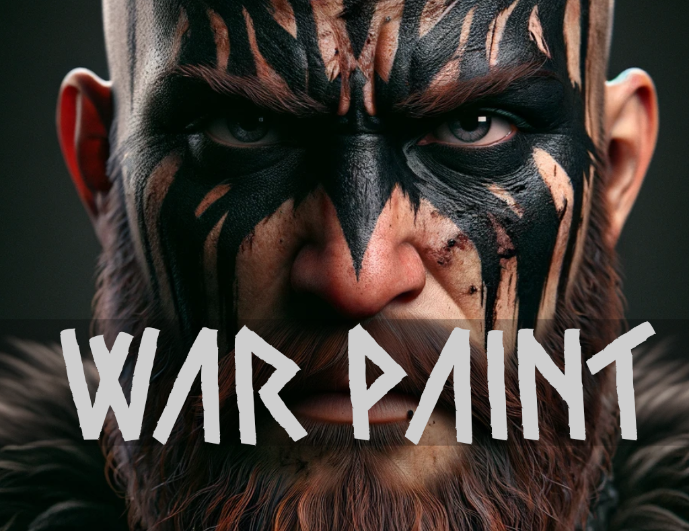
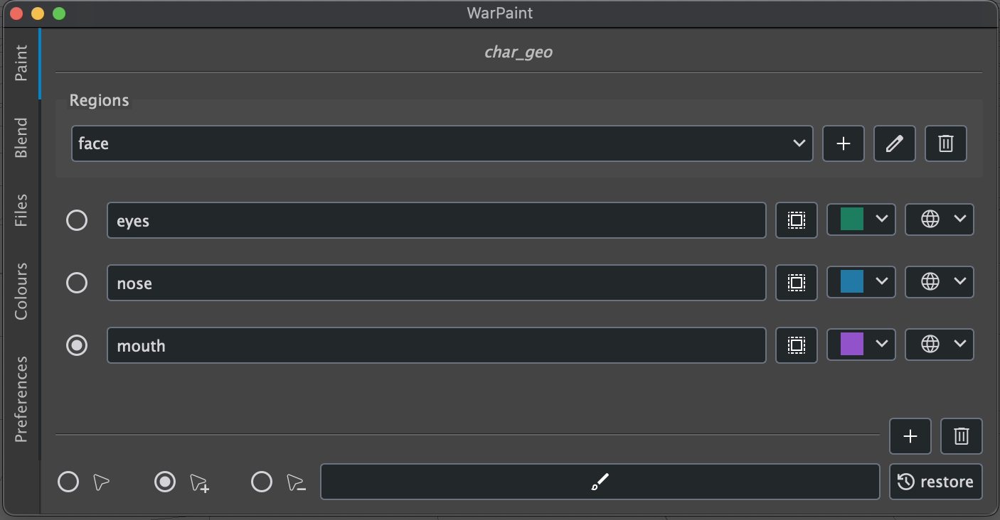
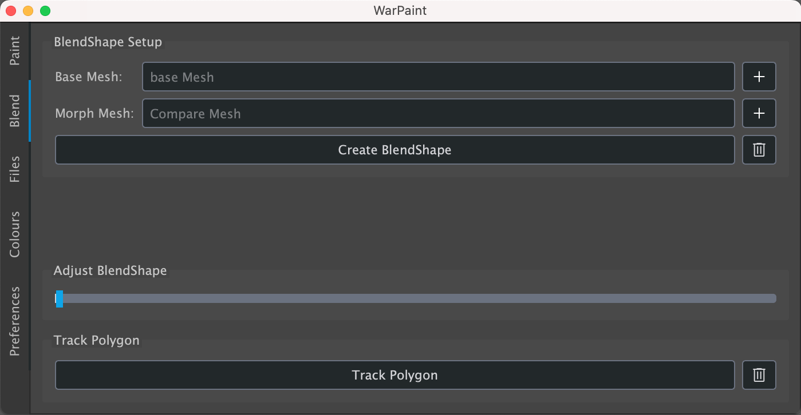
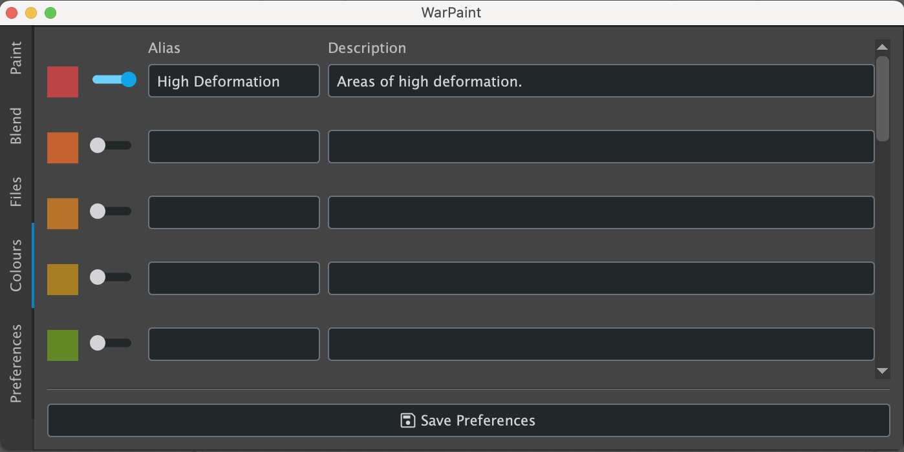

<a name="readme-top"></a><br>
<div align="center">
  <a href="https://blackswaneffect.com">
    
  </a>
  <p align="center">
  War Paint allows modelers to define precise landmarks on character meshes, ensuring
  uniform topology and alignment. This consistency is key for projects with multiple
  characters, as it facilitates the reuse of weights and deformers across different
  sculpts, significantly streamlining the rigging processes.
    <br/><br/>
    <a href="https://github.com/Black-Swan-Effect/war-paint/archive/refs/heads/main.zip"><strong>Download »</strong></a><br/><br/>
    <a href="#installation">Installation</a> ·
    <a href="https://github.com/Black-Swan-Effect/war-paint/issues">Report Bug</a> ·
    <a href="https://github.com/Black-Swan-Effect/war-paint/issues">Request Feature</a>
  </p>
</div>

### Requirements

| Python | Maya  |
|--------|-------|
| 3.7+   | 2022+ |

### Installation

1. Download and unzip *war-paint.zip*.
2. Inside `/installation`, drag&drop the file `drag_and_drop_install.py` into Maya's viewport.
3. War Paint should be successfully installed and you can launch it with:

    ```python
    from warpaint.warpaint_ui import WarPaintUI
    WarPaintUI.launch()
    ```

4. Optionally, the tool can be reloaded with:

    ```python
    from warpaint.library.setup import utils
    utils.reload_modules()
    ```

### Regions & Strokes



At the very top of the tool the name of the currently painted mesh will be displayed.
This is set automatically on the first paint and will thenceforward filter out any
polygons that do not belong to said mesh.

A stroke is a painted section of the mesh (e.g. eyes, nose, mouth, etc.) which can
be organised into regions (e.g. face, torso, limbs, etc.). On changing of regions,
the strokes of the active region will be highlighted while the rest will be faded.

While painting, the artist can choose between three different paint modes, namely:

* Add: the currently selected surfaces will be added to the painted polygons.
* Subtract: the currently selected surfaces will be subtracted from the painted polygons.
* Replace: the currently selected surfaces will replace the painted polygons.

### Blendshapes and Tracking



To better understand how the sculpt changed with respect to the base mesh, the artist
can blend them together and control the blendshape with the slider. This shows how
the polygons have been moved and deformed. Additionally, a specific polygon can be
tracked, which creates a setup with a constrained camera aimed perpendicular to the
surface.

### Colour Palette



The tool features 20 different colours, which can be used to paint the mesh. The palette
can be dynamically changed in terms of light and saturation to suit any preferences.
Furthermore, to each colour an alias and a description can be added, to better organize
the palette and define the purpose of each colour.

P.S. The range of colours was borrowed from [Tailwind CSS](https://tailwindcss.com/docs/customizing-colors)
that features an expertly-crafted default color palette. Thank you!

### Import / Export

Warpaint can be easily exported and imported to different meshes, as long as they
share the same point order. In fact, on import, the tool will check if the point
orders between the currently selected mesh and the imported data are the same.
